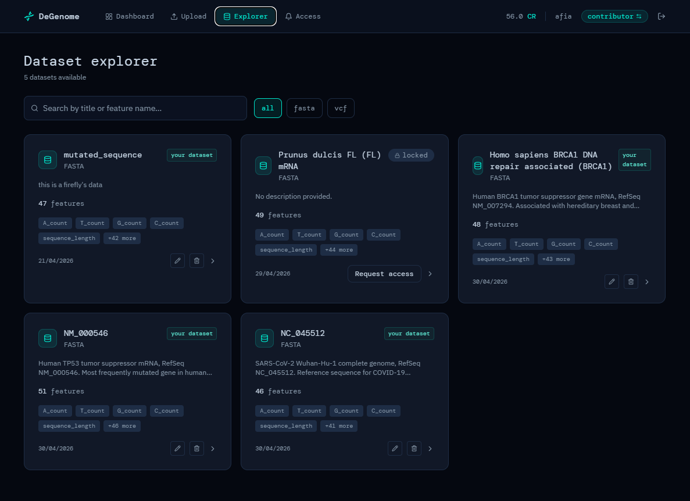
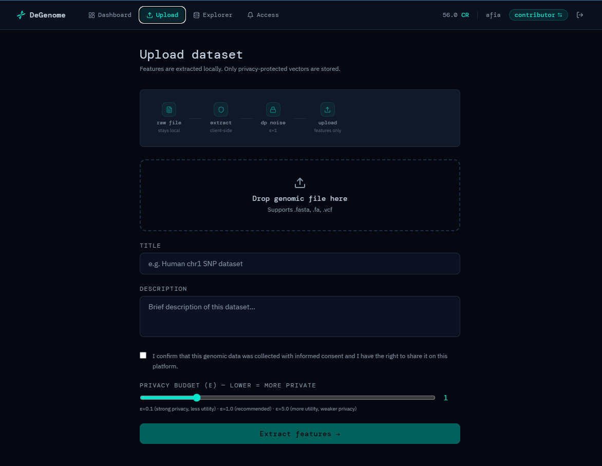
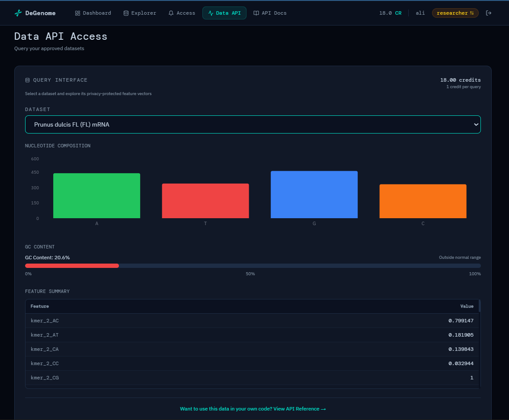

# DeGenome
### A Decentralized, Privacy-Preserving Infrastructure for Secure Genomic Data Sharing
---

## TL;DR

Genomic data is critical for modern medicine and biology, but remains difficult to share safely due to privacy risks and institutional barriers.

DeGenome is a two-sided platform that enables secure genomic data sharing without exposing raw sequences. All feature extraction and differential privacy are performed locally in the contributor’s browser before any data is transmitted.

The server stores only privacy-protected feature vectors and manages access through dataset-scoped API keys controlled by contributors. Researchers query these vectors programmatically for analysis and machine learning, while raw genomic sequences never leave the contributor’s device.

The system is designed so that privacy is enforced at the architectural level, not through policy or trust assumptions.

**→ [Try the live prototype](https://degenome.vercel.app)**






---

## The Problem

Genomic data is becoming foundational to modern biology and medicine. It drives personalized medicine, accelerates drug discovery, enables synthetic biology, and powers large-scale biological research. Sequencing costs have dropped by a factor of one million since 2001 and data generation is growing faster than our ability to use it.

Yet most of this data sits locked in silos.

Hospitals hold patient sequences behind regulatory walls. Biotech companies treat genomic databases as proprietary assets. Research institutions guard data behind months-long access committees. The result: researchers who need data cannot get it, and data holders who want to contribute have no safe way to do so.

**The barrier is not technical. It is the absence of a system that makes sharing safe, fair, and worth doing.**

Existing approaches fail in predictable ways:

| Approach | Why It Fails |
|---|---|
| Centralized data repositories | Single point of failure. Raw sequences exposed if server is compromised. |
| Access agreements and legal contracts | Slow, jurisdiction-dependent, and do not prevent misuse after access is granted. |
| Federated databases | Still require raw data to be queryable by a central authority. |
| Manual sharing via email or cloud storage | No access control, no audit trail, no privacy guarantee. |

---

## Solution

DeGenome separates two concerns that were previously coupled: **sharing genomic insights** and **exposing raw genomic sequences**. Contributors can do the former without ever doing the latter.

The core idea is that all privacy-sensitive computation happens in the contributor's browser before any data leaves their device. The server never sees raw sequences. It cannot be compelled to reveal what it does not have.

**Privacy is enforced by architecture, not policy.**

---

## How It Works

```
Contributor's Browser
│
├── 1. File selected (FASTA or VCF): stays in browser memory
│
├── 2. Feature Extraction (JavaScript, zero server involvement)
│       FASTA: nucleotide counts, GC content, Shannon entropy,
│              k-mer frequencies (k=2, k=3), sequence length, N ratio
│       VCF:   SNP/indel counts, Ts/Tv ratio, het/hom ratio,
│              allele frequency stats, per-chromosome variant counts
│
├── 3. Differential Privacy: Laplace noise applied in browser
│       Formal epsilon-DP guarantee. Configurable ε (0.1 to 5.0)
│       Only noised feature vectors leave the device
│
└── 4. Server stores only:
        DP-noised feature vectors, dataset metadata, Storj object key reference

Server never sees: raw sequences, encryption keys, or any data that can reconstruct them
```

Researchers discover datasets in the Explorer, request access with a stated purpose, and receive contributor approval. On approval, a dataset-scoped API key is automatically generated and delivered to the researcher. This key authenticates their queries against the platform API and returns the privacy-protected feature vectors for that specific dataset. They can integrate directly into Python, Jupyter, or Google Colab pipelines.

---

## Why Decentralized Storage

Centralized cloud storage is the wrong model for genomic data. One breach, one court order, or one compromised employee is enough to expose thousands of contributors' sequences permanently. DeGenome uses **Storj**: a decentralized object storage network where files are split into encrypted fragments and distributed across thousands of independently operated nodes globally. No single node, company, or government holds a complete or meaningful piece of the data.

Key properties relevant to genomic data:

- **No single point of control**: no central authority can be compelled to hand over the data
- **Erasure coding**: data remains fully recoverable even if a fraction of storage nodes go offline
- **Pseudonymous participation (planned v2)**: in the Web3 ecosystem, contributors will interact via wallet addresses rather than institutional identities, removing the need to tie genomic contributions to a real-world name
- **Censorship resistance (v1: feature vectors on PostgreSQL; v2: raw files on Storj)**: in the current version, DP-noised feature vectors are stored on a managed PostgreSQL instance. Full censorship resistance for raw file storage via Storj is a v2 property once raw file upload is enabled

### Raw File Sharing: Planned Architecture (v2)

The current platform shares only privacy-protected feature vectors. Raw file sharing is planned for v2 using an **RSA-wrapped AES key** architecture: a standard hybrid encryption pattern where the platform stores only RSA-encrypted key blobs that it cannot itself decrypt.

When a contributor uploads a raw file, an AES-256 key is generated in their browser, used to encrypt the file, and then wrapped with the contributor's RSA public key before being stored on the server. The server holds an encrypted blob that is computationally useless without the contributor's RSA private key, which never leaves their device. On researcher approval, the contributor unwraps and re-encrypts the AES key under the researcher's public key. The researcher decrypts locally and downloads the raw file directly from Storj.

This requires every user to hold an RSA key pair: which is why wallet-based identity is a prerequisite for v2, not just an incentive feature. A detailed technical specification will be published separately.

---

## Vision

DeGenome is designed to grow into a decentralized genomic data commons.

As contributors register datasets, the platform accumulates a queryable knowledge base of genomic feature distributions across diverse populations, organisms, and conditions. Unlike centralized genomic databases that require institutional approval processes lasting months, DeGenome enables real-time, permissioned access to privacy-protected genomic statistics.

Contributors retain permanent ownership and control. Researchers get immediate, programmatic access to population-level insights. The platform mediates trust between the two without becoming a custodian of sensitive data.

**The long-term vision: genomic knowledge circulates freely at the statistical level while raw sequences remain under the permanent control of those who generated them.**

Planned evolution:

- **Token economy**: blockchain-based contributor rewards tied to actual data usage
- **Wallet-based identity**: users identified by wallet addresses, enabling RSA key pairs for raw file sharing and pseudonymous participation
- **Raw file sharing**: RSA-wrapped AES key exchange; platform stores only encrypted blobs it cannot decrypt
- **Federated learning**: researchers train models on contributor data without data leaving contributor devices
- **ORCID integration**: verified researcher identity for institutional trust signals

---

## Current Features

**Privacy**
- Client-side feature extraction and Laplace differential privacy
- Configurable epsilon budget per dataset (0.1 to 5.0)
- Formal epsilon-DP guarantee: no reconstruction possible from released features
- Consent confirmation required on every upload

**Data Sharing**
- Two-sided marketplace: contributor and researcher roles with separate workflows
- Dataset Explorer with feature schema preview and format filtering
- Access request system with contributor approval and stated purpose
- Access history and audit trail for both roles
- Institutional email verification with badge display on dataset cards

**API Access**
- Dataset-scoped API keys auto-generated on contributor approval
- Keys delivered securely to researcher via one-time claim endpoint
- Contributor can view and revoke any active key at any time
- Dual authentication: JWT for browser sessions, API keys for programmatic access
- Query feature vectors from Python, Jupyter, or Google Colab

**Infrastructure**
- Decentralized file storage on Storj (S3-compatible, erasure-coded, globally distributed)
- IPFS metadata pinning via Pinata for tamper-resistant provenance records
- PostgreSQL persistence with full data ownership lifecycle
- Credit-based incentive system (proof of concept, moving to token economy in v2)

---

## Tech Stack

| Layer | Technology |
|---|---|
| Backend | Python 3.11, FastAPI, SQLAlchemy, PostgreSQL |
| Frontend | React 18, Vite, Tailwind CSS, Zustand |
| Privacy | Client-side Laplace Differential Privacy (JavaScript) |
| Storage | Storj decentralized object storage |
| Metadata | IPFS via Pinata |
| Auth | JWT, SHA-256 hashed API keys, bcrypt |
| Deployment | Render (backend), Vercel (frontend) |

---

## Quickstart (External API)

```python
import requests

API_KEY    = "your_key_from_approval"
DATASET_ID = "your_dataset_id"
BASE_URL   = "https://degenome.onrender.com"

response = requests.post(
    f"{BASE_URL}/data/query",
    headers={"Authorization": f"Bearer {API_KEY}"},
    json={
        "dataset_id": DATASET_ID,
        "feature_type": "nucleotide",  # nucleotide | kmer | snp
        "filters": {}
    }
)

features = response.json()["feature_vector"]
print(features)
# Ready to use as ML input: clf.predict([list(features.values())])
```

---

## API Reference

### Authentication
| Method | Endpoint | Description |
|---|---|---|
| POST | /auth/register | Create account (contributor or researcher) |
| POST | /auth/login | Login and receive JWT |
| PATCH | /auth/role | Switch role without logging out |
| GET | /auth/my-keys | List researcher's active API keys |
| GET | /auth/dataset-keys | List all keys issued for contributor's datasets |
| DELETE | /auth/api-keys/{id} | Revoke a key (contributor only) |

### Datasets
| Method | Endpoint | Description |
|---|---|---|
| GET | /datasets/presign | Get presigned Storj upload URL |
| POST | /datasets/register | Register dataset after upload |
| GET | /datasets/ | List all available datasets |
| GET | /datasets/my | List contributor's own datasets |
| PATCH | /datasets/{id} | Edit dataset title and description |
| DELETE | /datasets/{id} | Soft delete a dataset |

### Data Access
| Method | Endpoint | Description |
|---|---|---|
| POST | /data/query | Query feature vector by type (nucleotide, kmer, snp) |
| GET | /data/features | Get full feature vector for approved dataset |

### Access Control
| Method | Endpoint | Description |
|---|---|---|
| POST | /access/request | Request access to a dataset (researcher) |
| GET | /access/incoming | View incoming requests (contributor) |
| GET | /access/outgoing | View outgoing requests (researcher) |
| PATCH | /access/{id}/approve | Approve request and auto-generate API key |
| PATCH | /access/{id}/reject | Reject a request |
| GET | /access/{id}/claim-key | Claim generated key: one time only (researcher) |

---

## Project Structure

```
degenome/
├── backend/
│   ├── main.py
│   ├── requirements.txt
│   ├── render.yaml
│   ├── migrate.py                    # Schema migration script
│   ├── models/
│   │   ├── db.py                     # SQLAlchemy models
│   │   └── database.py               # DB session and engine
│   ├── routers/
│   │   ├── auth.py
│   │   ├── datasets.py
│   │   ├── data.py
│   │   ├── access.py
│   │   └── credits.py
│   └── services/
│       ├── auth.py
│       ├── credits.py
│       ├── ipfs.py
│       ├── storj.py
│       ├── validation.py             # Feature vector plausibility checks
│       └── institutions.py           # Institutional email verification
│
└── frontend/
    └── src/
        ├── pages/
        │   ├── Upload.jsx            # 5-step upload with storage options
        │   ├── Dashboard.jsx         # Stats, dataset keys, credit history
        │   ├── Explorer.jsx          # Browse and discover datasets
        │   ├── DataAPI.jsx           # In-app query interface with charts
        │   ├── ApiDocs.jsx           # External API reference and code snippets
        │   ├── AccessRequests.jsx    # Incoming, outgoing, and history tabs
        │   ├── Auth.jsx
        │   └── Landing.jsx
        ├── components/
        │   ├── Navbar.jsx
        │   ├── DatasetCard.jsx
        │   ├── Toast.jsx
        │   └── ToastContainer.jsx
        ├── utils/
        │   ├── featureExtraction.js  # Client-side FASTA/VCF extraction: 36/36 tests passing
        │   └── privacy.js            # Client-side Laplace DP: 40/40 tests passing
        ├── services/
        │   └── api.js
        └── store/
            └── authStore.js
```

---

## Security Model

Traditional platforms protect data with access controls and legal agreements. If the server is compromised, raw data is exposed. DeGenome removes this attack surface by ensuring the server never holds data worth stealing.

- **Privacy guarantee**: epsilon-differential privacy formally bounds the information an adversary can extract from any released feature value, regardless of how many queries they make
- **Storage guarantee**: Storj's erasure coding distributes encrypted chunks across thousands of independent nodes; no single node or company can reconstruct or delete the data
- **Architectural guarantee**: the server stores only DP-noised feature vectors and object key references; it never receives, processes, or decrypts raw file content at any stage
- **Custody guarantee (v2)**: raw file AES keys will be stored on the server only in RSA-encrypted form; the platform cannot decrypt them without the contributor's RSA private key, which never leaves their device

---

*DeGenome v1.0: Proof of Concept*
